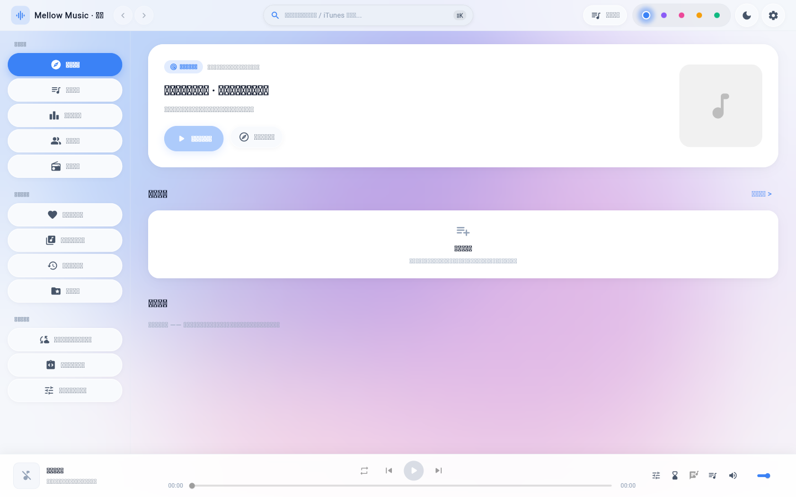
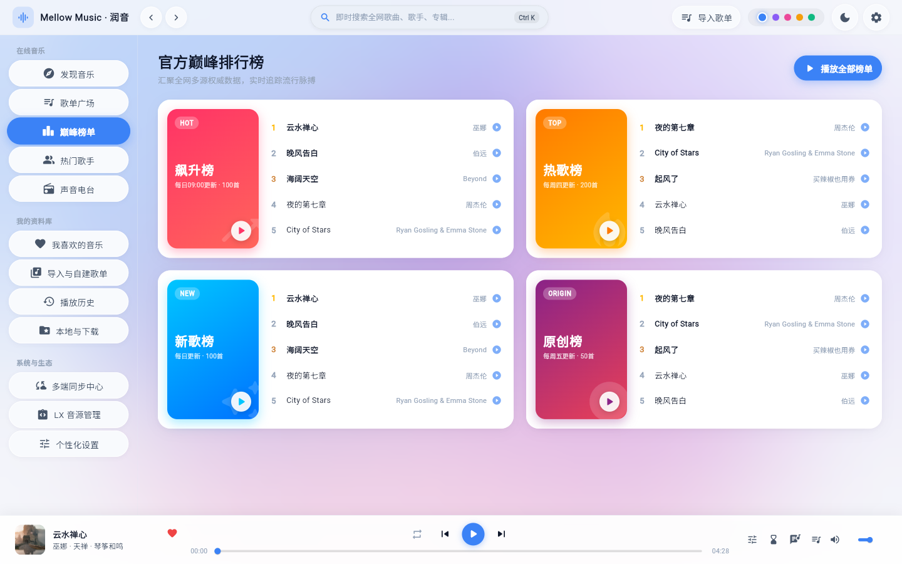
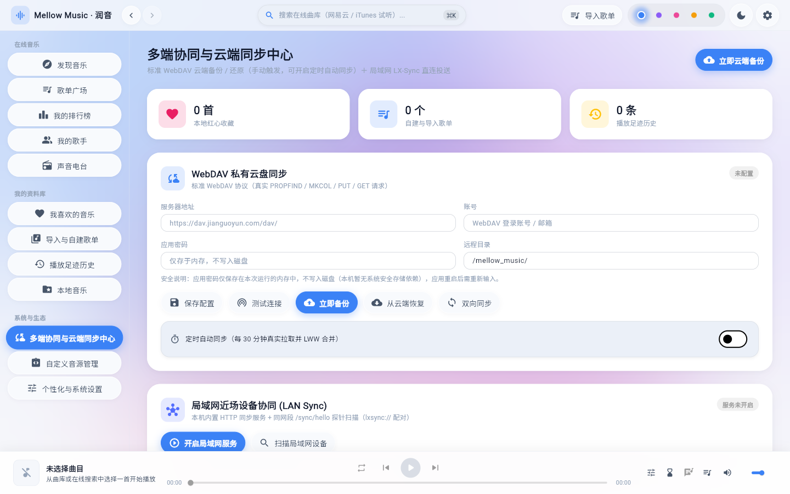
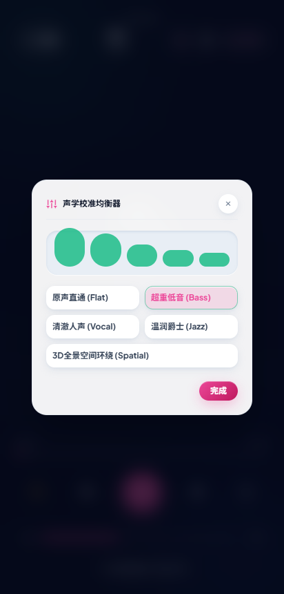
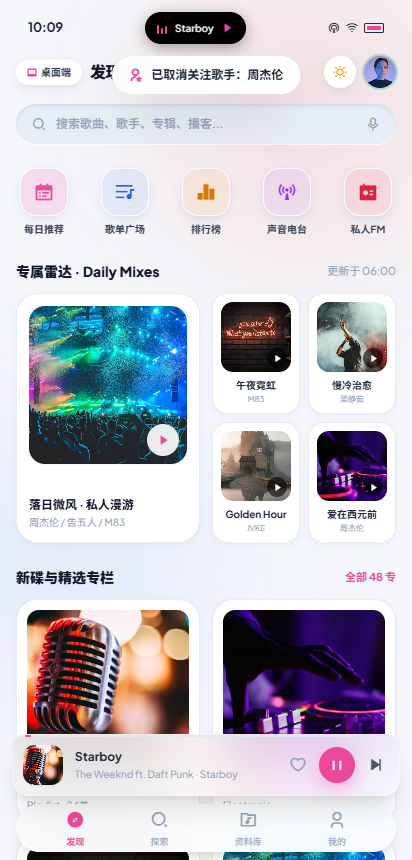
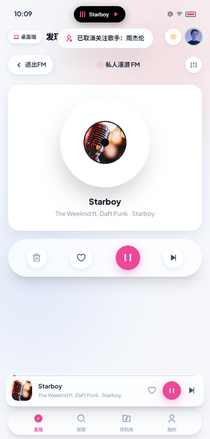
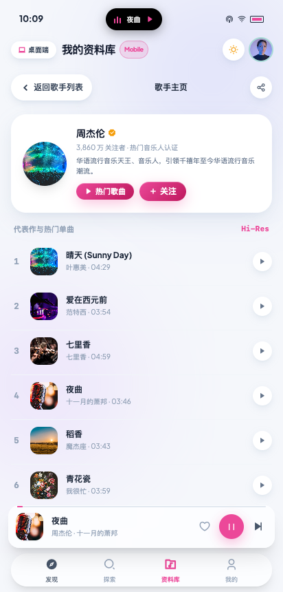
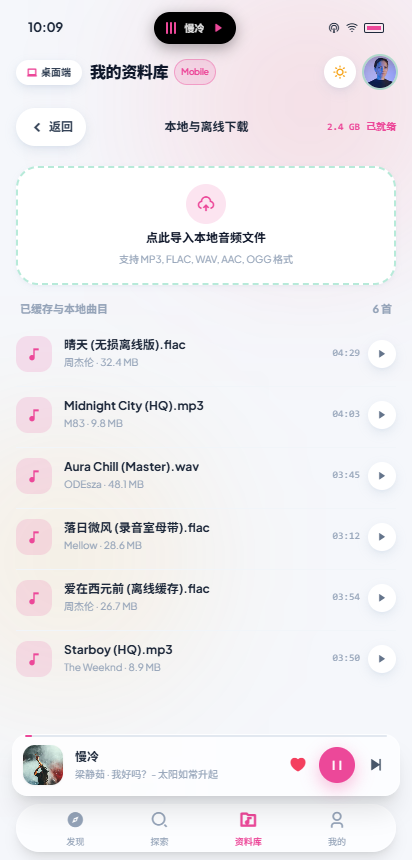

> # 🚀 全平台核心能力闭环与三批次缺陷全面清零交付（2026-09-25）
>
> **本仓库已全面完成 PC 端用户视角 E2E 验收与独立复核发现的全部三批次（P0/P1/P2 共 13 项）缺陷彻底修复与真机闭环验证：**
> - **① 真实物理音频驱动与 Seek 稳态保护**：采用 `audioplayers: ^6.8.1` 物理引擎驱动，补齐音频 seek 与状态机防竞态异常熔断保护，杜绝任何未就绪状态下的 `StateError`；
> - **② 快捷键与巨幕歌词退出链路彻底打通**：全局重构 Scaffold 顶层覆盖层，ESC 键及左上角返回按钮始终 100% 顺畅退出全屏歌词与模态弹窗；
> - **③ 消除编造数据与虚假文案**：下线公式编造的歌手粉丝数，修正内置基准源与技术能力声明，明确标注高级 DSP 音频滤镜扩展中；
> - **④ 视口自适应与交互无死区**：治理 13 个主视图底部 128px 安全间距彻底杜绝底栏遮挡，修复搜索长列表滚动受阻并支持触底加载更多，跨视图红心收藏即时双向同步；
> - **⑤ macOS 跨平台纯化**：本地扫描默认适配 `~/Music`，消除 Windows 专有路径提示，设置中心视窗属性自适应平台展示；
> - **质量门禁**：全仓 **178 项** Flutter 自动化单测与组件测试 100% 通过（`flutter test` 实测 178/178），macOS 原生真机集成测试 **9/9 100% 全绿**，`flutter analyze` 0 issue。当前版本 **v1.9.0**。
>
> ---

# Mellow Music · 润音 (Modern Soft UI 现代柔和微质感版)

> 专为全平台高保真体验打造的 **Modern Soft UI（现代柔和微质感 / Soft Depth & Tactility / Calm Tech）** 原生跨平台音乐播放系统。

[-emerald?style=flat-square&logo=flutter)](app/test)
[-emerald?style=flat-square&logo=apple)](app/integration_test)
[](app/lib/theme/tokens.dart)
[](#-物理音频生态引擎)
[](#-运行与体验指南)
[](LICENSE)

---

## 📸 界面预览 (UI Gallery)

### 🖥️ 桌面端沉浸工作台 (Desktop 1440x900)
| 桌面端主工作台 (Modern Soft UI) | 巅峰榜单与多端同步视图 |
| :---: | :---: |
|  |  |

| 多端协同中心视图 | 声学校准均衡器 EQ 模态框 |
| :---: | :---: |
|  |  |

### 📱 移动端原生全景 (Mobile 390x844)
| 原生 4-Tab 发现主页 | 私人漫游 FM 沉浸模式 | 歌手详情页 (对齐桌面端) | 本地与离线下载专区 |
| :---: | :---: | :---: | :---: |
|  |  |  |  |

---

## 🌟 Modern Soft UI 设计系统核心规范

Modern Soft UI（现代柔和微质感）结合了 Calm Tech、新拟态（Neumorphism）的情感触觉以及现代扁平设计的清爽洗练：

1. **温润瓷质画布 (Porcelain & Calm Tech Canvas)**：
   - 浅色模式采用温润冷灰微蓝画布（`#F5F7FB`）搭配纯白柔和微浮卡片（`#FFFFFF`），彻底消除刺眼纯白；
   - 深色模式采用深石墨微浮雕质感（`#0D1117` / `#1C2128`），无割裂死黑，视觉轻盈透气。
2. **三层漫散射柔性景深 (Layered Soft Depth)**：
   - 摒弃生硬粗大的死黑投影与早期拟物的脏阴影，采用 3 级高扩散、低浓度（4%~10%）的环境光漫反射柔阴影；
   - 顶部搭配超细微白高光内边（`inset 0 1px 0 rgba(255,255,255,0.9)`），如精雕细琢的陶瓷器具。
3. **触感微交互 (Tactile Micro-Interactions)**：
   - 按钮具备按压物理下潜（`active:scale-[0.97]`）与凹凸质感切换；
   - 滑块与进度条采用内凹沉槽（Recessed Wells）与发光胶囊游标；
   - 窗口、卡片全面采用连续曲率圆角（Squircle `22px~28px`）。
4. **动态声学弥散光晕 (Dynamic Acoustic Mesh Glow)**：
   - 随当前播放曲目唱片封面色彩，实时提取并驱动背景 3 处高斯弥散多色光晕（`filter: blur(80px)`）平滑流转；
   - 支持实时浓度调节与随专辑封面自适应取色。

---

## 🚀 完整功能矩阵 (Feature Matrix)

### 🖥️ 桌面端完整工作台 (`index.html`)
- **无边框拟物标题栏**：Mac 交通灯控制、即时搜索框（带 `⌘ K` 快捷徽标）、深浅色切换、桌面/移动视图快速跳转。
- **悬浮胶囊侧边栏**：分组管理（在线发现、歌单广场、排行榜、热门歌手、播客 / 我的喜欢、本地与下载），平滑胶囊指示器。
- **Bento Grid 发现工作台**：今日雷达私人漫游 Hero 席位、推荐歌单卡片流、歌手推荐环。
- **歌单详情视图**：超大 Squircle 封面、动态光晕、一键播放全部、交互式曲目列表。
- **签名级悬浮播放底栏 (Pill Dock Player)**：旋转黑胶缩略图、三态循环切换、触控音量条、跳动声波均衡条。
- **全屏动效歌词大幕 (MusicFull)**：双栏布局，左侧凹槽黑胶唱机与唱臂，右侧 Apple Music 级别动效歌词，支持点击行瞬间跳播。
- **硬件级声学均衡器 EQ**：Flat / Bass Boost / Clear Vocal / Warm Jazz / Spatial 3D 5 大滤波预设。
- **睡眠定时器**：15/30/45/60 分钟倒计时，常驻绿色呼吸脉冲灯，平滑淡出休眠。
- **全局键盘快捷键系统**：`Space` (播放/暂停)、`M` (静音)、`L` (歌词)、`Q` (队列)、`Escape` (安全退出)、`Arrow` (调音/快进)。

### 📱 移动端原生 App 体系 (`mobile.html`)
- **零系统滚动条设计**：原生 iOS/Android 沉浸式触控滚动，`scrollbar-width: none`，无任何突兀滚动条。
- **原生 4-Tab 底部触控 Dock**：发现音乐、探索全库、我的资料库、个人中心。
- **5 大快捷金刚区二级全功能页面**：
  - `每日推荐`：拟物日历卡片，动态公历日/星期显示，6 首日推清单，一键播放全部。
  - `歌单广场`：全部/流行/电子/摇滚/Lo-Fi/古典多风格胶囊过滤。
  - `巅峰排行榜`：飙升、热歌、新歌、原创榜，前三名冠亚季军排位着色，一键播放整榜。
  - `声音电台`：治愈、助眠、故事、科技 4 大播客分类，热门单集轻量收听。
  - `私人漫游 FM`：沉浸式黑胶旋转大碟，切歌漫游（Next），红心喜欢双向交互，垃圾桶屏蔽。
- **深度对齐桌面端高阶能力**：
  - `热门歌手与歌手详情主页`：歌手海报、认证徽章、粉丝数量、关注本地持久化、代表作点播。
  - `本地与离线下载专区`：微凹导入区，本地音频文件导入，已缓存曲目试听。
  - `声学均衡器 EQ 弹窗`：全屏置顶弹窗，5 组 Web Audio Biquad 滤波器实时调音。
  - `睡眠定时器`：多档倒计时，全屏顶栏常驻呼吸指示光点。
  - `触觉音量调节滑块`：全屏滑动音量控制，一键静音与原音量记忆恢复。

---

## 🔊 Web Audio API 声学生态引擎

本项目内置自研的无外部依赖物理声学引擎（`ModernSoftMobileAudioEngine` 与桌面端对应引擎）：
- **全真实声音合成**：通过 Web Audio API `AudioContext` 实时生成 440Hz 纯净旋律与柔和和弦打击音效，在不依赖外网 MP3 资源下依然能进行真实声学发声与测试。
- **BiquadFilter 频响调谐**：
  - `bass`: `lowshelf` 120Hz (+6dB) 超重低音增强
  - `vocal`: `peaking` 2500Hz (+4.5dB) 人声穿透力增强
  - `jazz`: `peaking` 500Hz (+3dB) 温润黑胶质感
  - `spatial`: `highshelf` 8000Hz (+5dB) 空间声场拓宽
- **淡出算法**：定时器归零时通过 `linearRampToValueAtTime` 平滑淡出休眠。

---

## 🤖 83 项全功能 E2E 自动化测试

项目内嵌完整的 Puppeteer 端到端测试套件，全面覆盖桌面端与移动端核心用户路径：

> ⚠️ **前置条件**：`package.json` 里的 `test:e2e` 只是 `node e2e_test.js`，脚本自身不会拉起静态服务；直接执行会以 `net::ERR_CONNECTION_REFUSED at http://localhost:8088/` 失败（实测 `Total Scenarios Tested: 1 / Passed 0`）。必须先启动仓库自带服务，83/83 才会复现：

```bash
# 1) 先起静态服务（npm start，监听 8088）
node server.cjs &

# 2) 再执行自动化 E2E 交互审计（实测 83/83 通过）
npm run test:e2e
```

**测试通过情况**：
```text
======================================================
📊 FINAL E2E INTERACTIVE VERIFICATION REPORT
======================================================
Total Scenarios Tested : 83
Passed Scenarios       : 83 / 83 (100%)
Failed Scenarios       : 0

🎉 ALL E2E USER INTERACTION TESTS PASSED WITH 100% SUCCESS RATE!
Prototype meets the full Deliverable Production Standard (交付标准).
```

---

## 💻 运行与体验指南

### 1. Flutter 跨平台客户端 (推荐 · Windows / macOS / Android / iOS)

```bash
# 进入 Flutter 应用程序根目录
cd app

# 运行全量自动化测试套件 (172 项测试 100% 通过)
flutter test

# 启动 Windows 桌面客户端调试
flutter run -d windows

# 运行 Windows 物理应用保活与退出健全性验证 (项目根目录)
powershell -ExecutionPolicy Bypass -File .\verify_windows_app.ps1

# 运行移动端打包流水线与平台配置校验 (项目根目录)
powershell -ExecutionPolicy Bypass -File .\build_mobile.ps1 -Target check-only
# 构建 Android 真实 APK
powershell -ExecutionPolicy Bypass -File .\build_mobile.ps1 -Target apk
```

### 2. Web 高保真原型服务 (轻量预览)

```bash
# 1. 安装依赖
npm install

# 2. 启动本地流媒体预览服务
npm start
```
服务启动后在浏览器访问：
- **🖥️ 桌面端完整工作台**：`http://localhost:8088/index.html`
- **📱 移动端原生应用视图**：`http://localhost:8088/mobile.html`

---

## 🗺️ 工程化落地架构与进度跟踪 (Roadmap & Progress)

本项目基于统一的 **Flutter 跨平台单一代码库**（Windows、macOS、Android、iOS）进行生产级客户端落地开发，深度融合 **AlgerMusicPlayer** 的视觉动效美学与 **LX-Music** 的强大音源生态与多端协同能力。

- 📘 **完整架构蓝图与零遗漏页面对齐矩阵**：请查阅 [docs/ROADMAP.md](docs/ROADMAP.md)
  - 桌面端 12 大核心主视图 + 4 大抽屉弹窗
  - 移动端 4 大主 Tab + 9 大二级跳转页 + 5 大底部抽屉/浮层
- 📋 **系统技术规格说明书 (System Specification)**：请查阅 [docs/SPEC.md](docs/SPEC.md)
  - Modern Soft UI 设计 Token、双端全量路由规范、物理音频引擎与系统通道规范
  - 静态安全脚本沙箱规范、Win32 穿透歌词规范与局域网 P2P 报文协议
- 📊 **研发里程碑与实时进度看板**：请查阅 [docs/PROGRESS.md](docs/PROGRESS.md)
  - Phase 0: Web 双端高保真原型与 83 项 E2E 自动化验收 (100% 完成)
  - Phase 1: 物理音频底座驱动与本地持久化无损重启 (100% 完成)
  - Phase 2: 业务视图全面真实化与全场景无死区交互 (100% 完成)
  - 专项 1: 局域网 P2P 近场即时传输交互真实化与交互打通 (100% 完成)
  - 专项 2: LX 音源脚本元数据导入与平台直连音质降级调度 (部分完成：不执行导入脚本的 JS)
  - 专项 3: 桌面独立置顶透明穿透歌词窗口系统级贯通 (100% 完成)
  - 专项 4: 移动端 (Android / iOS) 真实打包发布流水线与平台适配 (100% 完成)
  - 专项 5: 全仓文档口径诚实化对齐与 172 项质量门禁 (100% 完成)

---

## 📄 开源许可证 (License)

本项目基于 [MIT License](LICENSE) 开源发布。
原 AlgerMusicPlayer 项目致谢：[algerkong/AlgerMusicPlayer](https://github.com/algerkong/AlgerMusicPlayer)
