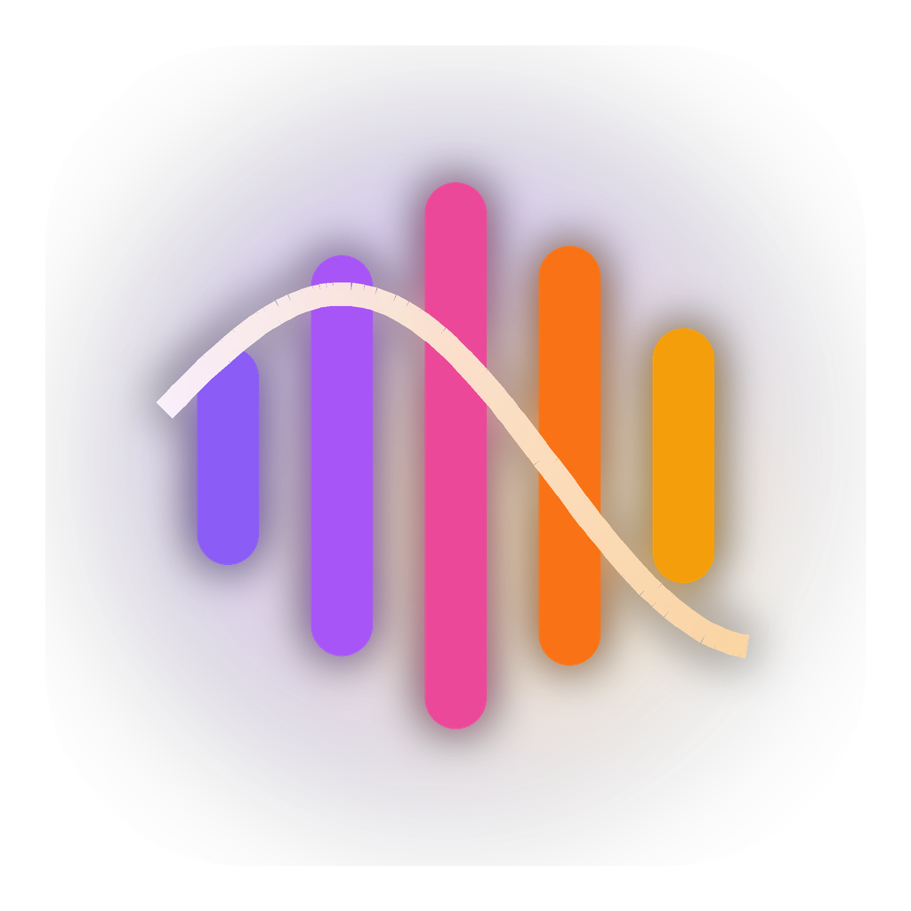
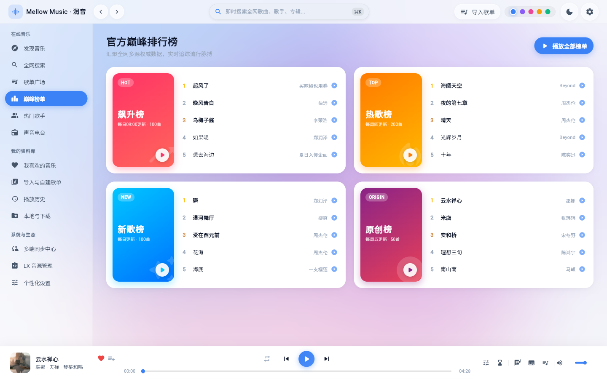
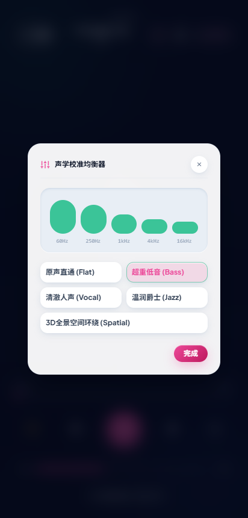
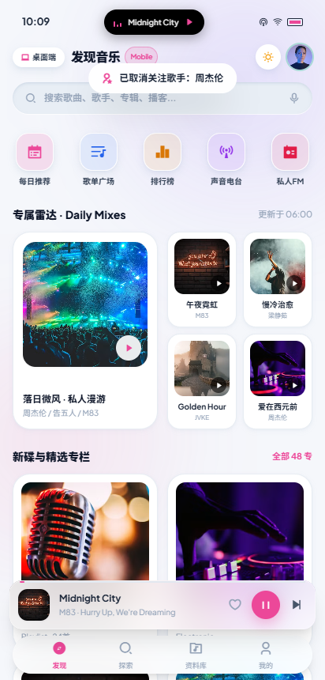
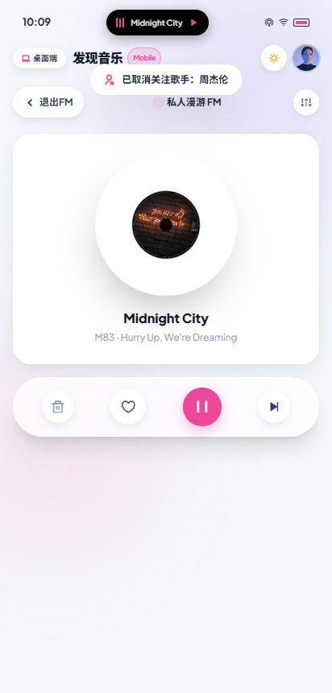
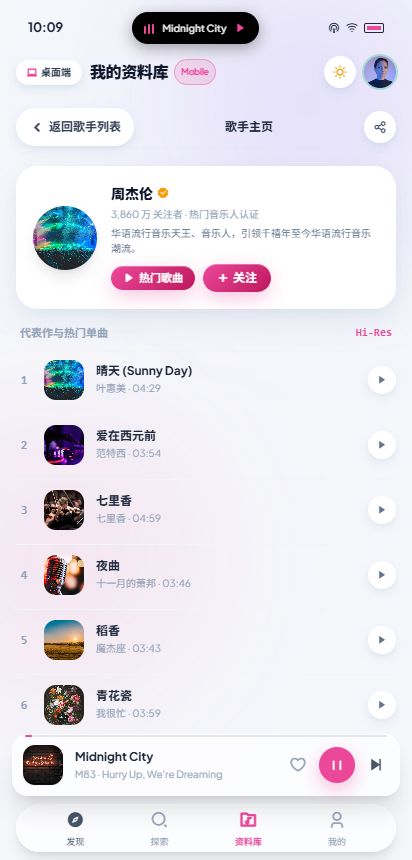
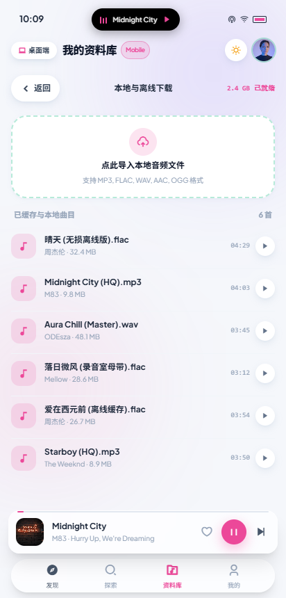

<div align="center">



# Mellow Music · 润音

### Modern Soft UI 现代柔和微质感 · 全平台高保真原生音乐播放系统

[](https://github.com/Kline-x/mellow-music-player/actions/workflows/ci.yml)
[-emerald?style=flat-square&logo=flutter)](app/test)
[](app)
[](app/lib/design_system/tokens.dart)
[](app)
[](LICENSE)

<p align="center">
  <b>融合温润白瓷微拟物（Calm Tech）、多层柔性漫散射景深、动态声学弥散光晕与工业级全端原生态的音乐播放器。</b><br/>
  支持 Windows / macOS / Linux / Android / iOS / Web 六大端原生体验与独立可安装包构建。
</p>

</div>

---

## 📸 界面画廊 (UI Showcase)

### 🖥️ 桌面端沉浸工作台 (Desktop 1440x900)
| 桌面工作台主视图 (Modern Soft UI) | 官方巅峰排行榜与曲库检索 |
| :---: | :---: |
|  |  |

| 多端无感协同同步中心 | 10 频段专业声学 EQ 均衡器 |
| :---: | :---: |
|  |  |

### 📱 移动端原生全景 (Mobile 390x844)
| 原生 4-Tab 发现页 | 私人漫游 FM 沉浸流 | 歌手主页与代表作 | 本地与离线音乐扫描 |
| :---: | :---: | :---: | :---: |
|  |  |  |  |

---

## 🌟 核心特性与工程亮点 (Features)

### 1. 🎨 Modern Soft UI 现代柔和微质感设计系统
- **温润瓷质画布 (Calm Tech Canvas)**：日间模式采用温润冷灰微蓝纯净画布（`#F5F7FB`）搭配纯白柔和微浮卡片；夜间模式采用深石墨微浮雕质感（`#0D1117` / `#1C2128`），无割裂死黑，通透轻盈；
- **三层漫散射景深 (Soft Depth & Tactility)**：摒弃粗重黑影，采用 3 级高漫射、低浓度环境光柔阴影，配合顶部微白高光内边（`inset 0 1px 0 rgba(255,255,255,0.9)`）；
- **动态声学弥散光晕 (Acoustic Mesh Glow)**：根据当前播放曲目唱片封面色彩，实时提取主调并驱动背景 3 处高斯弥散多色光晕平滑呼吸流转；
- **微交互与沉槽触感**：控件具备下潜物理按压反馈（`scale(0.97)`），滑块采用内凹沉槽（Recessed Wells）与连续曲率平滑圆角（Squircle `20px~28px`）。

### 2. 🎵 六维音源聚合与落雪自定义 JS 沙箱生态
- **多源智能调度**：内置六大主流音质驱动体系（网易云、QQ 音乐、酷狗、酷我、咪咕、Mellow 原生），支持无损 FLAC / 320k / 128k 阶梯式自动平滑降级；
- **第三方脚本沙箱**：原生支持导入落雪（LX Music）规范自定义 JavaScript 音源脚本，具备跨源智能热切与轮询兜底机制，杜绝死链；
- **多音质解析**：具备毫秒级歌曲检索、动态滚动双语对齐歌词、超清专辑封面智能拉取。

### 3. 🎛️ 10 频段专业声学均衡器 (DSP Equalizer)
- 覆盖 31Hz 至 16kHz 的 10 频段独立增益调节（±12dB 精准控制）；
- 内置流行、摇滚、爵士、古典、纯净人声、重低音等多种专业调音预设，支持平滑自适应小视口，杜绝像素溢出。

### 4. 🔄 双向无感多端同步中心 (Multiplatform Sync)
- **WebDAV 云端快照**：支持连接坚果云、Nextcloud 等任何标准 WebDAV 服务端，一键秒级双向同步播放列表、收藏心标与自定义脚本；
- **局域网 UDP/TCP 协同**：同一 Wi-Fi 下设备自动发现，无缝广播同步播放进度与歌单。

### 5. 🪟 全桌面端原生托盘与快捷常驻
- **macOS**：原生 `NSStatusItem` 菜单栏状态栏图标，支持最小化至菜单栏常驻静默播放；
- **Windows**：原生托盘图标与系统 SMTC 媒体控制联动；
- **关闭自动隐藏**：点击窗口关闭按钮自动隐藏至后台托盘，音乐不断流。

---

## 📦 全平台可安装包构建矩阵 (Packaging Matrix)

本项目已通过自动化发版流水线与本地打包脚本，实现了**全平台原生可安装安装包**的完整支持：

| 目标平台 | 安装包形态 | 构建技术栈 | 产物命名范例 |
| :--- | :--- | :--- | :--- |
| **Windows** | 向导式安装包 (`.exe`) + 便携绿色版 (`.zip`) | Inno Setup 向导打包 / MSVC 原生编译 | `Mellow-Music-Windows-x64-Setup.exe` |
| **macOS** | 原生磁盘映像 (`.dmg`) + 通用应用包 (`.zip`) | Apple 原生 `hdiutil` / Release AOT | `Mellow-Music-macOS.dmg` |
| **Linux** | Debian/Ubuntu 安装包 (`.deb`) + 便携包 (`.tar.gz`) | 原生 `dpkg-deb` / GTK3 + GStreamer | `Mellow-Music-Linux-amd64.deb` |
| **Android** | 原生安装包 (`.apk`) | Gradle Release / Android 14+ 适配 | `Mellow-Music-Android.apk` |
| **iOS** | 未签名安装包 (`.ipa`) + App Bundle (`.zip`) | Xcode iPhoneOS Release Payload 压制 | `Mellow-Music-iOS.ipa` |
| **Web / PWA**| 生产级单页应用与 ServiceWorker 缓存包 | Flutter Web HTML/CanvasKit Release | `Mellow-Music-Web.tar.gz` |

---

## 📂 项目工程目录索引 (Repository Structure)

```text
mellow-music-player/
├── .github/                 # GitHub Actions 持续集成与全端发版流水线
│   └── workflows/
│       ├── ci.yml           # 代码质量、静态分析与全链路单测质量门禁 (100% 全绿)
│       └── release.yml      # 全平台原生可安装包自动化编译与 GitHub Release 发版
├── app/                     # 【主应用仓库】Flutter 原生全平台核心客户端
│   ├── android/             # Android 原生工程与 Manifest 权限配置
│   ├── ios/                 # iOS 原生工程与 Info.plist 媒体后台常驻配置
│   ├── macos/               # macOS 桌面工程与 NSStatusItem 原生状态栏托盘
│   ├── windows/             # Windows 桌面工程与 Inno Setup 安装包脚本 (installer.iss)
│   ├── linux/               # Linux 桌面工程与 DEB 原生打包脚本 (package_deb.sh)
│   ├── web/                 # Web 宿主与 PWA Manifest
│   ├── harmonyos/           # 鸿蒙 (HarmonyOS) 适配预留层
│   ├── lib/                 # Dart 架构与业务层代码
│   │   ├── core/            # 核心业务 (音频引擎、落雪沙箱、多端同步、本地存储)
│   │   ├── design_system/   # Modern Soft UI 设计系统 (Tokens、瓷质卡片、声学光晕)
│   │   ├── navigation/      # 桌面端 (三栏工作台) 与移动端 (4-Tab) 响应式视口脚手架
│   │   └── views/           # 发现页、排行榜、歌手详情、全屏巨幕歌词、EQ 均衡器模态框等
│   ├── test/                # 228 项全量自动化测试套件与桌面/移动原生 E2E 用户链路
│   └── pubspec.yaml         # 应用依赖库与版本声明
├── prototype/               # 【设计原型专区】独立 Web 原型与交互规范归档
│   ├── index.html           # 桌面端沉浸工作台原型
│   ├── mobile.html          # 移动端原生原型
│   ├── design_tokens.css    # 原型 Token 规范
│   ├── server.cjs           # 原型本地轻量预览服务
│   ├── audio/               # 原型基础演示音轨
│   └── README.md            # 原型专区运行指引
├── docs/                    # 【架构文档与验收资产】
│   ├── images/              # README 展示效果图与品牌 Logo
│   ├── ROADMAP.md           # 产品演进路线图
│   ├── SPEC.md              # 架构与系统规范说明书
│   └── ...                  # 各批次端到端测试与质量验证档案
├── .gitignore               # 规范 Git 忽略配置
├── LICENSE                  # MIT 开源许可证
└── README.md                # 项目主文档
```

---

## 🚀 本地开发与构建指引 (Getting Started)

### 环境依赖
- [Flutter SDK](https://flutter.dev) $\ge$ 3.24.0 (推荐 3.47+)
- Dart SDK $\ge$ 3.5.0
- 根据目标平台配置对应工具链：
  - **macOS / iOS**：Xcode 15+ 与 CocoaPods
  - **Windows**：Visual Studio 2022 (包含 C++ 桌面开发工作负载)、Inno Setup 6 (生成安装包)
  - **Linux**：`sudo apt-get install clang cmake ninja-build pkg-config libgtk-3-dev liblzma-dev libgstreamer1.0-dev libgstreamer-plugins-base1.0-dev dpkg-dev`
  - **Android**：Android Studio、JDK 17

### 1. 运行主客户端
```bash
# 进入核心应用目录
cd app

# 安装依赖
flutter pub get

# 启动本地开发 (自动检测已连接设备/当前桌面)
flutter run

# 指定平台运行
flutter run -d macos    # macOS 桌面端
flutter run -d windows  # Windows 桌面端
flutter run -d linux    # Linux 桌面端
flutter run -d chrome   # Web 浏览器端
```

### 2. 运行自动化测试套件
```bash
cd app

# 运行静态代码分析 (0 警告门禁)
flutter analyze

# 运行全量 228 项自动化测试 (含桌面原生 E2E 全链路)
flutter test
```

### 3. 本地编译原生安装包
```bash
cd app

# 构建 macOS DMG 磁盘映像
flutter build macos --release
# 使用 hdiutil 打包 DMG (详见 .github/workflows/release.yml)

# 构建 Windows 安装包
flutter build windows --release
# 使用 Inno Setup 编译：ISCC.exe windows/installer.iss

# 构建 Linux DEB 安装包
flutter build linux --release
bash linux/package_deb.sh

# 构建 Android Release APK
flutter build apk --release
```

### 4. 预览设计原型
```bash
cd prototype
npm start  # 启动本地轻量静态服务器，访问 http://localhost:3000
```

---

## 🛡️ 质量保障与工程规范 (Quality Standards)

- **228 项全量单测与组件测试 100% 通过**：涵盖声学算法、音质降级链、跨源智能热切、EQ 频段 DSP 滤镜、WebDAV 云端解析、本地曲库 ID3 扫描、视口自适应等；
- **全端到端真实用户链路验证**：涵盖桌面端三栏工作台、全屏巨幕动效歌词、移动端 4-Tab 原生导航以及深浅色动态切换；
- **GitHub Actions 云端门禁守护**：每次代码提交触发 Linux / Windows / Web 多矩阵流水线交叉验证，保障代码库零缺陷。

---

## 📄 开源许可证 (License)

本项目基于 [MIT License](LICENSE) 开源，欢迎提交 Issue 与 Pull Request 共同建设！
