# Mellow Music · 润音 · 全平台客户端工程化落地技术方案与架构蓝图

> **项目愿景**：融合 **AlgerMusicPlayer** 的极致视觉美学（Modern Soft UI 现代柔和质感、声学生态流体光晕、动效巨幕歌词）与 **LX-Music (洛雪音乐)** 的强大音源架构与多端同步能力，打造一款面向 Windows、macOS、Android、iOS 的现代化全平台无损音乐播放器。

---

## 🏛️ 一、整体技术架构全景图 (System Architecture)

```mermaid
graph TD
    subgraph UI_Layer ["表现层 (Presentation Layer) · Modern Soft UI"]
        Responsive["响应式自适应脚手架 (Responsive Breakpoints: 600px / 1024px)"]
        DeskUI["🖥️ 桌面端工作台 (Bento Grid, Mac标题栏, 悬浮Dock, 队列抽屉)"]
        MobUI["📱 移动端应用形态 (原生4-Tab, 金刚区5大二级视图, 上滑黑胶页)"]
        SoftDS["🎨 ModernSoftUI 组件库 (SoftCard, SoftButton, RecessedWell, Squircle)"]
        LyricSys["🌌 双模歌词系统 (Apple Music级动效大幕 + 跨平台透明穿透桌面歌词)"]
    end

    subgraph State_Layer ["业务与状态管理层 (Bloc / Riverpod)"]
        PlayerBloc["播放器核心状态机 (PlayerState, Queue, PlayMode, History)"]
        SourceBloc["音源管理与搜索聚合 (ScriptManager, SearchEngine)"]
        SyncBloc["多端同步中心 (WebDAV Client, LX-Sync Lan Server/Client)"]
        PlaylistBloc["歌单与收藏夹系统 (Playlists, Favorites, Import/Export)"]
        SettingsBloc["个性化与设置 (Theme, AccentColor, MeshGlow, EQPresets)"]
    end

    subgraph Engine_Layer ["核心引擎与运行时 (Core Engines)"]
        MediaKit["🎵 media_kit 解码核心 (基于 libmpv, 支持 FLAC/APE/DSD/MP3)"]
        AudioService["🎧 audio_service 系统通道 (Android MediaSession / iOS MPRemote / Win SMTC)"]
        QuickJS["⚡ flutter_js (QuickJS 沙箱, 兼容 LX-Music 六音音源脚本规范)"]
        LyricEngine["📜 LRC / QRC / Krc 逐字歌词解析与贝塞尔插值平滑渲染引擎"]
        AudioDSP["🎛️ 10 频段硬件均衡器 (libmpv equalizer 滤镜 + 预设校准)"]
    end

    subgraph Infra_Layer ["基础设施与持久化 (Storage & Platform Channels)"]
        Database["💾 Drift (SQLite3 FTS5) 工业级响应式数据库 (本地数十万曲库, 索引, 歌单外键关联)"]
        AudioCache["📁 本地音频流式缓存系统 (LRU 策略, 离线无损缓存)"]
        PlatformChannels["🔌 原生平台通道 (desktop_multi_window 穿透子窗口, Android 浮窗, SMTC)"]
    end

    UI_Layer --> State_Layer
    State_Layer --> Engine_Layer
    Engine_Layer --> Infra_Layer
```

---

## 📋 二、1:1 原型与全功能零遗漏对齐矩阵 (Zero-Omission View Matrix)

### 1. 桌面端视图与模态全量清单 (12 主视图 + 4 弹窗抽屉)

| 原型模块 ID | 对应组件 | 路由路径 | 详细功能与交互说明 | 状态保证 |
| :--- | :--- | :--- | :--- | :---: |
| `viewDiscover` | `DesktopDiscoverView` | `/desktop/discover` | **发现音乐主页**：Bento Grid 仪表盘、今日私享雷达 Hero 卡片、推荐歌单网格、热门歌手环、新歌速递流 | ✅ 1:1 对齐 |
| `viewPlaylists` | `DesktopPlaylistSquareView` | `/desktop/playlists` | **歌单广场**：精选/流行/治愈/电音/民谣多标签即时筛选、卡片流式展示 | ✅ 1:1 对齐 |
| `viewToplist` | `DesktopToplistView` | `/desktop/toplist` | **官方巅峰榜**：飙升榜、热歌榜、新歌榜、原创榜四大榜单，冠亚季军排位，一键整榜播放 | ✅ 1:1 对齐 |
| `viewArtists` | `DesktopArtistsView` | `/desktop/artists` | **热门歌手库**：歌手头像圆形网格、官方认证徽章、粉丝量展示、快速进入歌手专页 | ✅ 1:1 对齐 |
| `viewArtistDetail` | `DesktopArtistDetailView` | `/desktop/artist/:id` | **歌手详情页**：超大圆角海报背景、关注/已关注本地持久化状态、热门单曲及代表专辑列表 | ✅ 1:1 对齐 |
| `viewPodcast` | `DesktopPodcastView` | `/desktop/podcast` | **声音电台**：深夜治愈、助眠白噪、音乐故事、科技前沿四大板块及单集收听 | ✅ 1:1 对齐 |
| `viewFavorite` | `DesktopFavoriteView` | `/desktop/favorite` | **我喜欢的音乐**：红心歌单、歌曲计数角标、快速批量播放、取消/添加收藏即时同步 | ✅ 1:1 对齐 |
| `viewHistory` | `DesktopHistoryView` | `/desktop/history` | **播放历史**：按时间倒序记录全部播放足迹，支持一键清空与重播 | ✅ 1:1 对齐 |
| `viewLocal` | `DesktopLocalMusicView` | `/desktop/local` | **本地与下载**：微凹拖拽/点击导入区、音频格式与比特率解析、本地曲库管理与离线播放 | ✅ 1:1 对齐 |
| `viewSettings` | `DesktopSettingsView` | `/desktop/settings` | **个性化设置**：深石墨/温润白瓷切换、五大柔光强调色、光晕浓度调节、音源与音质偏好 | ✅ 1:1 对齐 |
| `fullscreenLyrics` | `DesktopFullscreenLyricsView` | `/desktop/lyrics` | **巨幕沉浸歌词 (MusicFull)**：左侧微凹黑胶大碟+旋转唱臂，右侧 Apple Music 式动效歌词与点击跳播 | ✅ 1:1 对齐 |
| `viewSourceManager` | `DesktopSourceManagerView` | `/desktop/sources` | **LX 音源脚本管理**：自定义音源脚本导入、在线解析、启用/禁用切换与版本自动更新 | ✅ 深度集成 |
| `queueDrawer` | `PlaybackQueueDrawer` | 侧滑抽屉 | **右侧播放队列抽屉**：当前播放列表、正在播放高亮、删除单曲、一键清空列表 | ✅ 1:1 对齐 |
| `eqModal` | `EqualizerModal` | 模态弹窗 | **声学 10 频段 EQ 调节窗**：31Hz~16kHz 频段滑块、重低音/人声/纯净等预设一键切换 | ✅ 1:1 对齐 |
| `sleepTimerModal` | `SleepTimerModal` | 模态弹窗 | **睡眠定时器**：15/30/45/60 分钟定时暂停、播放完当前歌曲后再停止选项 | ✅ 1:1 对齐 |
| `searchDropdown` | `QuickSearchOverlay` | 悬浮浮层 | **快捷全局搜索**：支持快捷键 `Ctrl/Cmd + K` 呼出，即时联想歌手、专辑与单曲 | ✅ 1:1 对齐 |

---

### 2. 移动端视图与模态全量清单 (4 主 Tab + 9 二级页面 + 5 底部抽屉)

| 移动端原型 ID | 对应组件 | 路由路径 | 详细功能与交互说明 | 状态保证 |
| :--- | :--- | :--- | :--- | :---: |
| **Tab 1: 发现** (`mViewDiscover`) | `MobileDiscoverTab` | `/mobile/tabs/discover` | 顶部灵动岛沉浸条、全局搜索胶囊、5 大金刚区入口、专属雷达滑动卡片 | ✅ 1:1 对齐 |
| **Tab 2: 探索** (`mViewExplore`) | `MobileExploreTab` | `/mobile/tabs/explore` | 动态标签过滤器（流行/民谣/轻音乐等）、风格精选歌单与曲目推荐流 | ✅ 1:1 对齐 |
| **Tab 3: 资料库** (`mViewLibrary`) | `MobileLibraryTab` | `/mobile/tabs/library` | 个人歌单聚合、本地与下载快捷入口、我关注的歌手、红心收藏歌曲清单 | ✅ 1:1 对齐 |
| **Tab 4: 我的** (`mViewProfile`) | `MobileProfileTab` | `/mobile/tabs/profile` | 用户信息卡片、温润白瓷/深石墨极速切换、强调色圆盘选择、音质与缓存清理 | ✅ 1:1 对齐 |
| `mViewDailyRecommend` | `MobileDailyRecommendPage` | `/mobile/recommend` | **每日推荐二级页**：拟物日历便签头（公历实时日期）、精选 6 首日推歌曲、一键播放全部 | ✅ 1:1 对齐 |
| `mViewPlaylistSquare` | `MobilePlaylistSquarePage` | `/mobile/playlists` | **歌单广场二级页**：分类胶囊横向滚动筛选，双列歌单网格瀑布流 | ✅ 1:1 对齐 |
| `mViewToplist` | `MobileToplistPage` | `/mobile/toplist` | **巅峰排行榜二级页**：四大官方榜单竖向卡片，冠亚季军曲目高亮，一键播放榜单 | ✅ 1:1 对齐 |
| `mViewRadio` | `MobileRadioPage` | `/mobile/radio` | **声音电台二级页**：深夜助眠、音乐故事等 4 个专栏单集清单 | ✅ 1:1 对齐 |
| `mViewPersonalFM` | `MobilePersonalFMPage` | `/mobile/fm` | **私人漫游 FM 二级页**：全屏沉浸大黑胶转动、Next 切歌漫游、红心切换、垃圾桶丢弃 | ✅ 1:1 对齐 |
| `mViewArtists` | `MobileArtistsPage` | `/mobile/artists` | **热门歌手库二级页**：歌手纵向列表，头像微凹描边，粉丝数据展示与快速进入 | ✅ 1:1 对齐 |
| `mViewArtistDetail` | `MobileArtistDetailPage` | `/mobile/artist/:id` | **歌手详情二级页**：沉浸式折叠海报、已关注/关注切换、代表作列表 | ✅ 1:1 对齐 |
| `mViewLocal` | `MobileLocalMusicPage` | `/mobile/local` | **本地与下载二级页**：离线已下载音乐列表、设备文件扫描导入、存储空间占用显示 | ✅ 1:1 对齐 |
| `mViewPlaylistDetail` | `MobilePlaylistDetailPage` | `/mobile/playlist/:id` | **歌单详情二级页**：大封面头图、作者信息、收藏歌单、播放全部 | ✅ 1:1 对齐 |
| `mFullLyrics` | `MobilePlayerBottomSheet` | 全屏浮层 | **全屏播放器/歌词页**：大黑胶唱机与全屏动效歌词双向滑动切换、进度条拖动与声波指示 | ✅ 1:1 对齐 |
| `mQueueSheet` | `MobileQueueBottomSheet` | 底部抽屉 | **底部播放队列抽屉**：上滑呼出待播列表、正在播放高亮、删除与一键清空 | ✅ 1:1 对齐 |
| `mEqModal` | `MobileEqBottomSheet` | 底部弹层 | **移动端均衡器弹层**：手势触觉滑动调节各频段、声学预设快速套用 | ✅ 1:1 对齐 |
| `mSleepTimerModal` | `MobileSleepTimerBottomSheet` | 底部弹层 | **移动端定时器弹层**：倒计时选择、夜间自动休眠关闭 | ✅ 1:1 对齐 |
| `mVolumeTrack` | `MobileVolumeModal` | 浮层组件 | **触觉音量调节器**：滑块触感反馈、一键静音与原值恢复 | ✅ 1:1 对齐 |

---

### 3. Alger & LX-Music 深度特性扩展清单

| 特性模块 | 涉及视图/组件 | 详细规划说明 |
| :--- | :--- | :--- |
| **LX 音源脚本引擎** | `DesktopSourceManagerView` & `ScriptEditor` | 集成 `flutter_js` QuickJS 运行时沙箱，支持解析 LX-Music 六音脚本的 `search`、`getMusicUrl`、`getLyric`、`getPic` 规范，提供脚本链接一键导入与测试功能。 |
| **外部歌单链接导入** | `ExternalPlaylistImportDialog` | 支持用户直接粘贴网易云音乐、QQ 音乐、酷狗歌单公开分享链接，自动解析歌曲名与歌手列表，并利用当前可用音源全网搜索匹配并建立本地歌单。 |
| **多端云同步 & LAN 扫码直连** | `CloudSyncView` & `QrSyncModal` | 1. **WebDAV**：配置坚果云/Nextcloud/群晖，实现歌单增量双向加密同步； 2. **局域网直连 (LX-Sync)**：桌面端开启内置 HTTP 服务生成配对二维码，移动端扫码瞬间同屏互传歌单。 |
| **独立桌面透明穿透悬浮歌词** | `DesktopFloatingLyricWindow` | 基于 Flutter 多窗口机制，在 Windows / macOS 上生成可置顶、无边框、支持鼠标防误触点击穿透（`WS_EX_TRANSPARENT`）的桌面动效歌词小组件。 |

---

## 💎 三、核心工程实施方案 (深水区架构规范)

### 1. 音源引擎：Dart 注入 Polyfill 桥接 QuickJS 沙箱
- **运行时环境**：集成 `flutter_js`（底层为轻量级 QuickJS C 原生沙箱），纯原生内存隔离，零端口占用，全平台极速冷启动。
- **Dart Polyfill 桥接层**：
  - 由 Dart 向 JS 上下文注入标准 `globalThis.lx` 对象；
  - `lx.request(url, options, callback)` 经由 Dart 原生 `dio` / `http` 代理发起，自动绕过 CORS 并注入合规 User-Agent；
  - 注入 `lx.utils.buffer`（二进制 Buffer 模拟）与 `lx.utils.crypto`（基于 Dart 原生 `pointycastle` / `crypto` 提供 AES、RSA、MD5、DES 加解密），完美兼容 LX-Music 六音官方脚本。
- **脚本标准规范**：
  - `search(query, page, type)`：跨平台关键字/歌手/专辑统一聚合检索。
  - `getMusicUrl(songInfo, quality)`：按音质等级（`128k`, `320k`, `flac`, `flac24bit`）动态解析真实播放直链。
  - `getLyric(songInfo)`：获取双语/翻译/逐字 LRC 歌词数据。
  - `getPic(songInfo)`：获取高清专辑封面 URL。

### 2. 音频解码与声学 DSP：分级双流架构 (Dual-Stream Architecture)
- **解码底座**：采用基于工业级 `libmpv` 的 `media_kit`，原生支持 FLAC、APE、OGG、DSD 及 Hi-Res 24bit/192kHz 无损音频回放。
- **分级双流通信机制**：
  - **前台 60fps 高刷渲染流**：UI 动效大幕歌词、胶囊进度条、跳动声波直接监听 `media_kit.stream.position`，在 Dart 内存中进行毫秒级高刷贝塞尔平滑滚动，杜绝卡顿；
  - **系统媒体节流广播 (Throttled Broadcast)**：向 `audio_service` 系统通道（Windows SMTC、Android MediaSession、iOS Control Center）进行 **1 秒防抖节流广播**（仅在每秒整点或发生 Seek/切歌事件时上报），彻底避免高频 IPC 广播导致的系统卡顿、电量雪崩或 Android ANR。
- **声学 10 频段均衡器 (DSP Equalizer)**：
  - 通过 `libmpv` 的 `equalizer` 滤镜实时注入频响调校参数，包含 Flat、Bass Boost、Clear Vocal、Warm Jazz、Spatial 3D 预设与自定义调节。

### 3. 双模动效歌词系统：应用内全屏大幕 + 独立透明穿透子窗口
- **应用内全屏动效大幕 (`MusicFull`)**：
  - Apple Music 级动态流体光晕背景（提取唱片 3 处主色 + `CustomPainter` + `BackdropFilter`）。
  - 逐字/逐句高帧率自适应插值平滑贝塞尔滚动。
  - 点击任意歌词行即刻跳播并伴随触觉微震动反馈。
- **独立透明桌面穿透歌词 (`desktop_multi_window`)**：
  - 主播放器与桌面歌词分别运行在独立渲染引擎与窗口中；
  - 桌面端配置 Win32 扩展样式 `WS_EX_TRANSPARENT | WS_EX_LAYERED`，支持鼠标防误触点击穿透（点击歌词直接操控其背后的游戏或网页）；
  - 主窗口与悬浮歌词窗口通过跨窗口通信总线秒级同步歌词进度。
  - Android 端使用 `SYSTEM_ALERT_WINDOW` 实现系统级浮窗歌词。

### 4. 本地数据库：Drift (基于 SQLite3) 响应式存储架构
- **选型决议**：选用 Flutter 官方主推的 `Drift` 响应式数据库取代 Isar，消除未来新版本 Flutter/Dart 的 C++ FFI 符号冲突风险。
- **核心数据模型**：
  - `SongsTable`：管理本地与在线歌曲元数据、比特率、本地缓存路径；
  - `PlaylistsTable` 与 `PlaylistSongsTable`：支持歌单与歌曲多对多关联、自定义排序索引；
  - `HistoryTable`：基于时间戳记录播放足迹；
  - `SourcesTable`：自定义音源脚本元数据与版本管理；
  - 内置 SQLite3 FTS5 全文搜索模块，支持本地数十万曲库毫秒级极速联想检索。

### 5. 多端云同步与局域网直连 (LX-Sync 100% 原生兼容)
- **WebDAV 云备份**：支持坚果云/Nextcloud/群晖，定时增量双向加密同步歌单与收藏夹。
- **局域网扫码直连 (LX-Sync 协议兼容)**：
  - 电脑端内置轻量 HTTP/WebSocket 服务（默认端口 `23332`），生成配对二维码；
  - 移动端扫码直连，遵循 LX-Music 原生数据包规范（公私钥签名、gzip 压缩传输），**原生兼容与现有 LX-Music 电脑版/手机版双向互相同步歌单**！

---

## 📅 四、5 阶段渐进式工程实施路线图 (5-Phase Roadmap)

- **Phase 1**：核心播放底座 (`media_kit` + `audio_service` 双流架构) 与 Modern Soft UI 设计系统组件库
- **Phase 2**：QuickJS 音源脚本引擎 (Dart Polyfill 桥接) 与全网聚合搜索
- **Phase 3**：桌面端 12 大核心视图与移动端 13 大页面 1:1 完整构建
- **Phase 4**：双模动效歌词体系 (`MusicFull` + `desktop_multi_window` 穿透歌词) 与声学 10 频段 EQ
- **Phase 5**：Drift 本地数据库、多端云同步 (WebDAV / LX-Sync 局域网互联)、外部歌单解析与自动化 CI/CD

